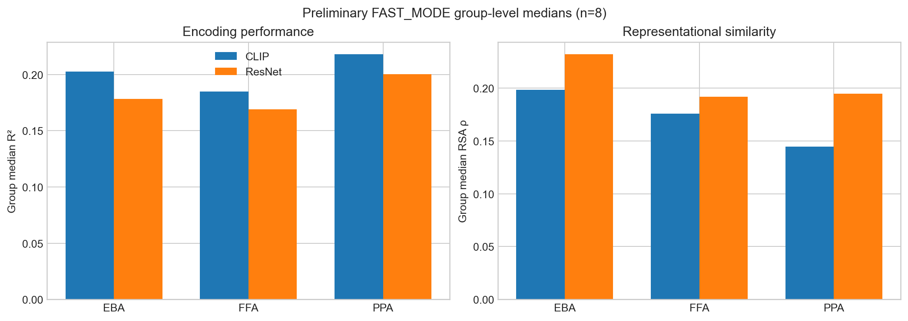
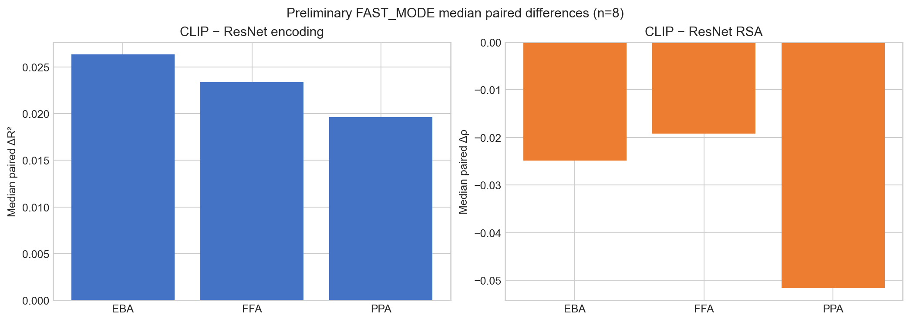

# Visual-cortex encoding and representational similarity with CLIP and ResNet

This project asks whether two pretrained vision models—CLIP ViT-B/32 and ResNet-50—capture
human visual-cortex responses to natural images. It combines vertex-wise ridge encoding,
representational similarity analysis (RSA), nested cross-validation, permutation testing,
and paired group-level comparisons across eight Algonauts 2023 participants and three
bilateral regions of interest (EBA, FFA, and PPA).

> **Result status:** every numerical finding below is a **preliminary FAST_MODE result**.
> These values were produced with **3 outer folds, 2 inner folds, 200 RSA permutations,
> and a 600-image RSA subset per subject**. The named `full` configuration has been defined
> for a future approved run, but no full-mode result is reported here.

## Preliminary FAST_MODE findings

The preliminary results suggest a metric-dependent model comparison: CLIP has higher
group-level median encoding R², while ResNet has higher group-level median RSA ρ in all
three reported ROIs. These are descriptive group summaries from eight subjects, not
official Algonauts challenge-test scores.

| ROI | CLIP median R² | ResNet median R² | Median paired ΔR² | CLIP median RSA ρ | ResNet median RSA ρ | Median paired Δρ |
|---|---:|---:|---:|---:|---:|---:|
| EBA | 0.202 | 0.178 | +0.026 | 0.199 | 0.232 | −0.025 |
| FFA | 0.185 | 0.169 | +0.023 | 0.176 | 0.192 | −0.019 |
| PPA | 0.218 | 0.200 | +0.020 | 0.145 | 0.195 | −0.052 |

Values are group-level medians. “Median paired Δ” is the median across subjects of each
subject's CLIP-minus-ResNet difference. It need not equal the difference between the two
group medians. The machine-readable table is in [`results/findings.csv`](results/findings.csv),
and the exact preliminary run description is in
[`results/preliminary_fast_mode_manifest.json`](results/preliminary_fast_mode_manifest.json).





Both figures are generated from the validated CSV and manifest with one command:

```bash
python scripts/build_readme_figures.py
```

The generator validates the exact CSV schema, expected EBA/FFA/PPA rows, preliminary status,
and subject count before plotting. Rendering may vary slightly with plotting-library, font, and
operating-system versions; the repository does not promise byte-identical PNG hashes across
environments. The figures contain no additional analysis or subject-level claims.

## Evaluation design and leakage prevention

Algonauts provides training fMRI responses and withholds test fMRI responses. Consequently,
this repository does **not** report performance on the official challenge test set.

For encoding, each subject is modeled independently:

1. The supplied training responses are aligned with pretrained image features in stimulus order.
2. An outer shuffled K-fold split creates internal held-out evaluation folds.
3. Within each outer training fold, `RidgeCV` selects one ridge α using the inner folds.
4. The selected model is fitted on that outer training fold and evaluated only on its held-out fold.
5. Per-vertex R² is averaged over outer folds and summarized within each ROI.

The source responses are supplied session-normalized and averaged across repeats, so each
subject-level analysis matrix contains one row per retained training stimulus. Model features
are extracted without using fMRI responses. CLIP and ResNet comparisons are paired by subject
and ROI, and the same deterministic 600-image subject-level subset is used across ROIs for RSA.
Subjects are never pooled to fit an encoding model. The current split is random at the image
level; session-aware or category-aware splitting is a separate scientific decision and is not
changed in this infrastructure stage.

## Methods

- **Data:** Algonauts 2023, derived from the Natural Scenes Dataset (NSD); eight subjects.
- **ROIs:** bilateral EBA, FFA (FFA-1/2), and PPA from the supplied challenge-space mappings.
- **Features:** OpenCLIP ViT-B/32 (`laion2b_s34b_b79k`) and torchvision ResNet-50
  (`IMAGENET1K_V1`), using their model-specific image preprocessing and L2-normalized features.
- **Encoding:** vertex-wise ridge regression with nested cross-validation; per-vertex R².
- **RSA:** correlation-distance fMRI RDMs, cosine-distance feature RDMs, Spearman ρ, and a
  two-sided label-permutation test. The existing feature-wise standardization behavior is retained.
- **Group summaries:** medians across subjects; paired CLIP-minus-ResNet comparisons by ROI.

## Repository structure

```text
.
├── .github/workflows/ci.yml
├── notebooks/
│   ├── 1. data_prep_roi-extract.ipynb
│   ├── 2. encoding_rsa.ipynb
│   ├── 3. group-aggregation_viz.ipynb
│   └── 4. models_comparison.ipynb
├── results/
│   ├── figures/
│   │   ├── preliminary_group_medians.png
│   │   └── preliminary_paired_deltas.png
│   ├── findings.csv
│   └── preliminary_fast_mode_manifest.json
├── scripts/build_readme_figures.py
├── src/algonauts_rsa/       # reusable configuration and analysis functions
├── tests/test_smoke.py       # synthetic-data test; no NSD download required
├── DATA.md
├── CITATION.cff
├── pyproject.toml
└── requirements.txt
```

The repository does not contain NSD/Algonauts images, fMRI matrices, model feature caches,
full RDMs, or links to external derived-output folders.

## Reproducible setup

Python 3.10 or 3.11 is recommended. The lightweight test path does not download neural data
or pretrained model weights.

```bash
python -m venv .venv
# macOS/Linux: source .venv/bin/activate
python -m pip install --upgrade pip
python -m pip install -e ".[dev]"
pytest
```

On Windows PowerShell, activate with `.\.venv\Scripts\Activate.ps1`; in Command Prompt,
use `.venv\Scripts\activate.bat`. Install `.[features,analysis]` only for notebook runs that
need pretrained feature extraction and the complete interactive analysis environment. CI uses
only the lightweight core and development dependencies and never downloads model weights.

Set portable paths with environment variables:

```bash
export ALGONAUTS_DATA_ROOT=/path/to/algonauts_2023_tutorial_data
export ALGONAUTS_OUTPUT_ROOT=/path/to/derived_outputs
export ALGONAUTS_RUN_MODE=fast  # smoke | fast | full
```

PowerShell equivalents:

```powershell
$env:ALGONAUTS_DATA_ROOT = "D:\data\algonauts_2023_tutorial_data"
$env:ALGONAUTS_OUTPUT_ROOT = "D:\results\algonauts_outputs"
$env:ALGONAUTS_RUN_MODE = "fast"
```

Path precedence is explicit `get_paths(data_root=..., output_root=...)` arguments, followed by
the documented environment variables. A run without configured roots stops with an actionable
error instead of guessing paths. In Colab, mount the desired storage and pass its paths explicitly
or set both environment variables before calling `get_paths()`. See [`DATA.md`](DATA.md) for
concrete access and directory instructions.

### Named configurations

| Mode | Purpose | Outer/inner folds | Permutations | RSA subset |
|---|---|---:|---:|---:|
| `smoke` | Synthetic or one-subject structural check | 2 / 2 | 10 | 32 |
| `fast` | Configuration used for preliminary results | 3 / 2 | 200 | 600 |
| `full` | Defined for a future approved final run | 5 / 3 | 1,000 | All retained images |

Defining `full` does not imply that it has been executed.

## Data access, attribution, and limitations

Data access is governed by the Algonauts 2023 and NSD terms. This repository provides code
and small derived summaries only. Users must obtain the dataset from its official source and
must not infer that the repository grants redistribution rights. See [`DATA.md`](DATA.md).

This work uses pretrained model implementations and weights from OpenCLIP and torchvision.
Their licenses and the licenses of the underlying pretrained weights remain separate from this
repository. A repository code license is intentionally not supplied yet while code ownership
and third-party licensing are clarified.

Current limitations include the small group size (`n=8`), three selected ROIs, internal
image-level cross-validation rather than official challenge-test evaluation, and RSA
subsampling in FAST_MODE.

## Citation

- Gifford et al. (2023), *The Algonauts Project 2023 Challenge: How the Human Brain Makes
  Sense of Natural Scenes*. <https://doi.org/10.48550/arXiv.2301.03198>
- Allen et al. (2022), *A massive 7T fMRI dataset to bridge cognitive neuroscience and
  computational intelligence*. <https://doi.org/10.1038/s41593-021-00962-x>

Project attribution metadata is available in [`CITATION.cff`](CITATION.cff).
